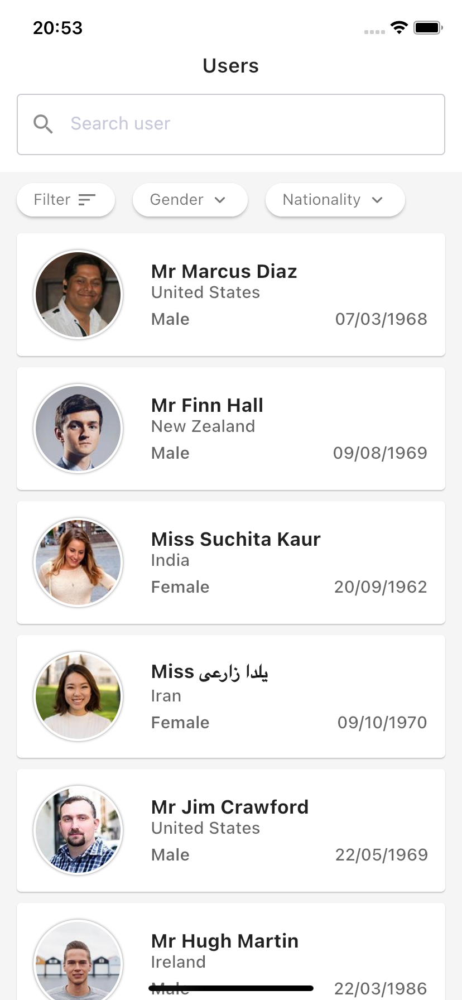
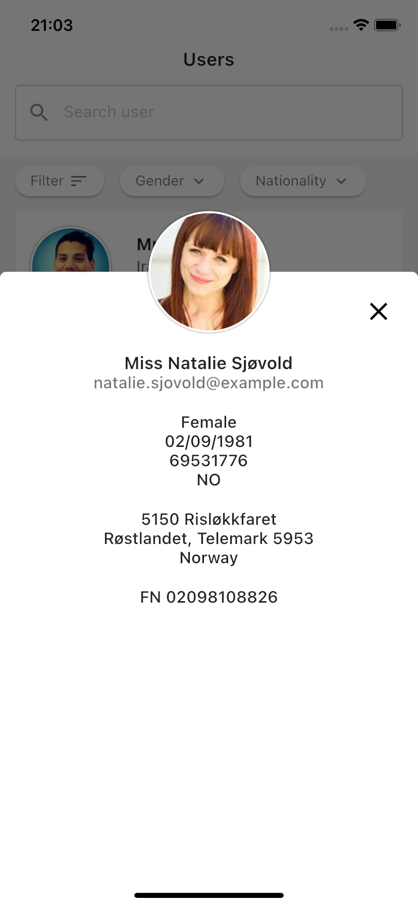
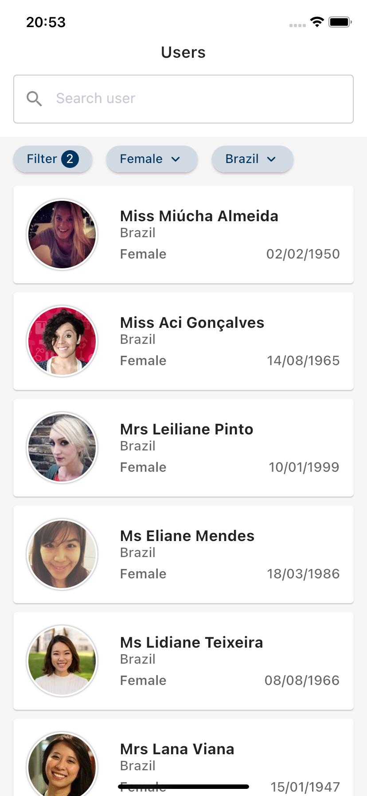
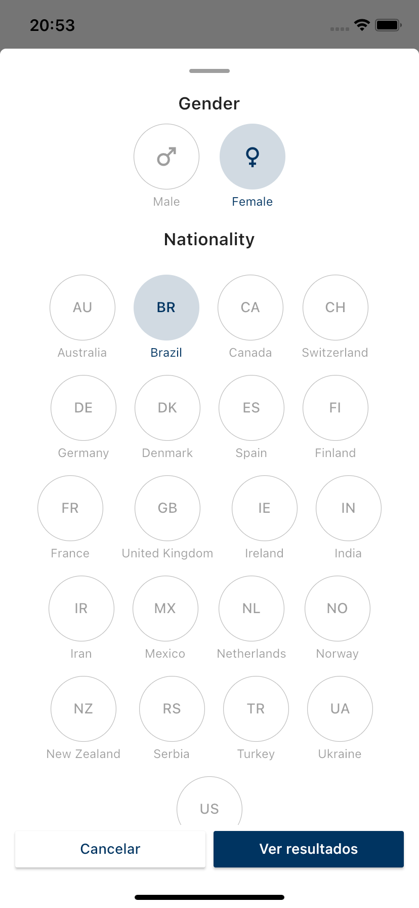
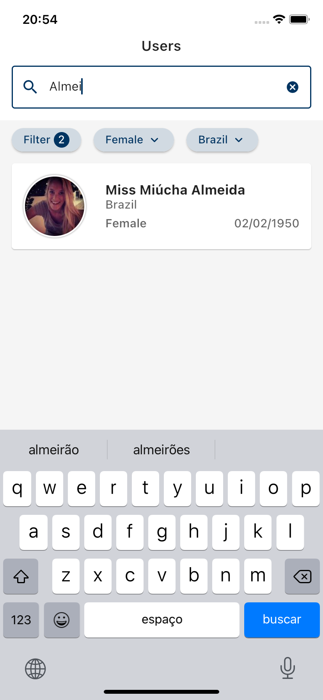

# Mobile challenge by [Coodesh](https://lab.coodesh.com/public-challenges/mobile-challenge)

* [Link apresentação](https://www.loom.com/embed/4ef8d5290e9b461f83514ae0b592836b)

## Projeto (mobilechallenge - My Users).

* Todos os requisitos do projeto foram cumpridos e o designer do Wireframe foi seguido, mas ouve pequenas adaptações, principalmente na questão do filtro.

## Stack de desenvolvimento
* Flutter

**Ferramentas**
* cocoapods 1.11.2, Android Studio Dolphin e xcode 13.2.1.

## Ambiente de desenvolvimento

Para a instalação é só seguir a documentação do [Flutter](https://flutter.dev/docs/get-started/install) para mac, windows ou linux.

### Procedimento de instalação para macOS (intel) com zsh

Realizar o download da [versao Flutter 3.3.4](https://flutter.dev/docs/get-started/install/macos).

**Passo 1:** No console insira os comandos de acordo com o passo a passo descrito [aqui](https://flutter.dev/docs/get-started/install/macos)

**Passo 2:** Abrir o arquivo ```~/.zshrc``` e inserir a seguinte linha:

```
export PATH=${PATH}:"$HOME/development/flutter/bin"
```
Atualizar a janela para identificar o novo ```PATH```.

**Passo 3:** Execute o comando ```flutter doctor``` se tudo estiver correto ele irá mostrar a versão do flutter.

**Passo 4:** Inslatar o [android studio](https://developer.android.com/studio) e o [xcode](https://apps.apple.com/br/app/xcode/id497799835?mt=12)

Obs: No Android é necessario ter sdk instalada a partir da 21, mas recomendado é a 29. No xcode é necessário abrir para aceitar os termos e condições antes de realizar um start.


**Passo 5:** instalar o cocoapods.

```
sudo gem install cocoapods
```

obs: Após instalar rode ```pod --version``` se estiver tudo correto irá exibir a versão do pod.

**Passo 6:** Se estiver usando android studio necessário instalar plugins Flutter e Dart. Se estiver usando vscode como editor de texto, então é necessário instalar a externsao [Flutter](https://marketplace.visualstudio.com/items?itemName=Dart-Code.flutter) e [Dart](https://marketplace.visualstudio.com/items?itemName=Dart-Code.dart-code),

**Passo 7:** Execute ```flutter doctor``` e veja se ha mensagens em vermelho, isso indica o que ainda falta a ser feito, o próprio console te diz o que deve ser feito, basta seguir.

### Rodando o projeto no Android.

**Passo 1:** Crie um emulador no avd do android studio ou adicione um dispositivo físico ao mac/windows, para que o dispositivo seja reconhecido é necessário deixa-lo em modo desenvolvimento (android), consulte a doc  de seu dispositivo, no iphone basta que seja compatível com o a versão do xcode.

**Passo 2:** Com dispositivo conectado ou emulador android aberto execute o comanda ```flutter run```, para verificar uma perfomance de qualidade recomendo o uso de dispositivo físico e executar o projeto em modo profile ```flutter run --profile```.

Obs: Se quiser executar o projeto com ```Hot reload``` ligado é ncessário acessar aba debug do vscode e dar play em vez de executar o comando no console, no android studio também tem um modo deste.


### Rodando o projeto no iOS.

**Passo 0:** Abra um simulador do iOS  digitando o comando no console ```open -a Simulator```, feito isso execute no console com o folder do projeto como raiz do console.
```
flutter pub get && flutter run
```
Pra verificar uma perfomance de qualidade recomendo o uso de dispositivo fisico e executar o projeto em modo profile:

 ```
flutter pub get && flutter run --profile
 ```

**Obs:** Caso receba algum erro, pule para o passo 1.

**Passo 1:** Abra o arquivo ```Runner.xcwordspace``` que fica em ```mobilechallenge/ios```.

**Passo 2:** Com projeto aberto e o menu folder selecionado no lado esquerdo do xcode, clique em ```Runner``` no lado esquerdo do xcode e então ele irá exibir as abas do lado direito.

**Passo 4:** Selecione ```Signing e Capabilities``` e verifique se ```Automatically manage signing``` está selecionado, se não estiver selecione, o menu Team deve ficar com ```Personal team``` selecionado, feito isso o xcode irá provisionar um profile developer automaticamente.

**Passo 5:** Voltando a android/vscode você já pode executar o comando no console.

```
flutter pub get && flutter run
```
Pra verificar uma perfomance de qualidade recomendo o uso de dispositivo fisico e executar o projeto em modo profile:

 ```
flutter pub get && flutter run --profile
 ```

Obs: Se quiser executar o projeto com ```Hot reload``` ligado é ncessário acessar menu debug no top do android/vscode e dar play, em vez de executar o comando no console, no android studio também tem um modo deste.


## Estrutura

```
.
├── main.dart
└── src
    ├── app_main.dart
    ├── bloc_observer.dart
    ├── locator.dart
    ├── core
    │   ├── certificate
    │   ├── enum
    │   ├── error
    │   ├── extension
    │   ├── http
    │   ├── images
    │   ├── library
    │   └── usecases
    ├── data
    │   ├── datasource
    │   ├── model
    │   └── repositories
    ├── domain
    │   ├── entities
    │   ├── repositories
    │   └── usecases
    └── presentation
        ├── bloc
        ├── pages
        ├── route
        └── theme
```
## Image
<p align="center">
  
  
  
  
  
</p>


